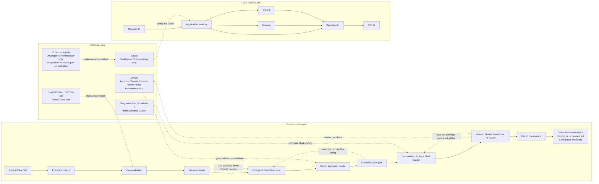

# AI Output Eval Lab

> 一个用于 **Grounded Structured Brief Generation** 的可审计 Prompt 评测工作台。
> 从 Dev failure analysis 出发，通过 frozen Prompt、Holdout、deterministic rules、
> Blind Grader、Human Review 与 paired comparison，验证一次 Prompt 修改是否真的带来改善。

An auditable Prompt-evaluation workflow for evidence-driven prompt iteration.

**Final status:** Formal experiment complete<br>
**Recommended version:** Prompt v2<br>
**Confidence:** Moderate

## 项目概览 / Overview

这个项目不是“比较两条 Prompt，看哪条感觉更好”，而是建立一个可复核的
evaluation loop：

```text
固定 Task Contract
      → 固定 Formal Case Set
      → Prompt v1
      → Dev evaluation
      → failure analysis
      → Prompt v2 minimal revision
      → frozen Holdout
      → deterministic rules + Blind Grader
      → Human Review
      → paired comparison
      → final recommendation
```

核心原则是：Prompt revision 必须有 Dev evidence；Holdout 不用于调 Prompt；
automatic evaluation 与 Human Review 分层；provenance 全程保留；历史错误不
静默覆盖。

这是个人 LLM Evaluation / AI 产品分析项目，不是 production A/B test、industry
benchmark、统计验证或 fully automated model-API evaluation platform。

### 系统与评测流程 / Architecture & Evaluation Flow



## 为什么做这个项目 / Why this project

一次输出“看起来更好”并不能证明 Prompt 改动有效。项目把 Task Pack、Case Set、
Prompt snapshot、Rule、Blind Grader、Human Review、run metadata 和 correction
trail 都保存下来，使 Prompt iteration 能够回答：failure mode 是什么、修改是否
直接针对证据、Holdout 是否保持同方向变化，以及是否引入 regression。

## 评测任务 / What it evaluates

固定 Task Pack 是 **Grounded Structured Brief Generation**。模型只能使用
`source_material` 直接支持的事实，并生成严格 JSON：

```json
{
  "title": "string",
  "summary": "string",
  "key_points": ["string", "string", "string"]
}
```

正式 contract 使用 `len(text.strip())`：

- `title`：4–20 characters；
- `summary`：60–120 characters；
- `key_points`：恰好 3 条，每条 6–40 characters；
- 自然语言主体为简体中文；
- factual claims 必须得到 `source_material` 的直接支持。

## 实际操作流程 / How the Experiment Was Actually Run

### 1. Formal Case Set

- 设计并 QA 24 个 fictional、self-contained Cases；
- 18 Dev / 6 Holdout；
- 每个 Case 保存 `source_material`、`source_facts` 和 `required_fact_ids`；
- Formal Case Set freeze 后，不因实验结果修改 Case。

### 2. Prompt v1 Dev Run

- Prompt v1 完成 owner approval 和 freeze；
- 使用 18 个 Dev Cases，通过 ChatGPT Web 手工执行；
- 每个 Case 使用 clean new conversation，只记录 first actual response；
- 不 follow-up、不修 JSON、不因质量问题 retry；
- raw output 写入正式 SQLite，随后执行 deterministic rules 和 Blind Grader。

### 3. Failure Analysis

Dev v1 为 `12 pass / 6 fail / 0 indeterminate`，6/6 failures 都是
`summary_length`，失败 summary 为 55–59 characters。JSON/schema、title、
key_points、required facts、groundedness、language 和 readability 没有 failure。

### 4. Prompt v2 Revision

Prompt v2 是 minimal evidence-driven revision，只增加约 70–100 characters 的
generation target 和 source-grounded silent self-check。没有修改 JSON schema、
required facts、closed-world groundedness、title / key_points requirements 或正式
60–120 pass/fail range。70–100 是 generation target，不是 hard rule。

### 5. Formal Holdout

Prompt v2 approval / freeze 后才首次使用 6 个 Holdout Cases。v1 / v2 使用相同
Case identities、相同 generator environment 和相同 Grader Condition，每个 Case
独立生成，不依据 Holdout 结果继续修改 Prompt。

### 6. Human Review

抽样结果进入匿名 Human Review。renderer display bug 导致 4 条 original review
被正式定性为 `procedure-invalid`。原记录永久保留，并通过 authorization-gated
append-only corrective re-review 形成独立 correction layer：

```text
4 original fail → 4 corrected pass → 4 effective pass
```

Human Review 不覆盖 automatic `calculated_status`。

### 7. Paired Comparison

`HOLDOUT-COMP-02` 的 automatic paired result 为：

```text
1 improved / 5 unchanged / 0 regressed / 0 indeterminate
```

唯一 improved 是 `brief-holdout-03`：`summary_length: fail → pass`，
`58 → 62 characters`。

## 模型与工具 / Models & Tools

| 环节 / Stage | 模型或工具 / Model & Tool | 用途 / Role |
| --- | --- | --- |
| Generator | ChatGPT Web — GPT-5.6 Sol | Dev / Holdout 的正式模型输出 |
| Blind Grader | DeepSeek Web — Condition 2 | Required facts、groundedness、language、readability 的 pointwise semantic evaluation |
| Human Review | Owner | sampled outputs 的人工复核与 corrective re-review |
| Engineering | Codex | Python / SQLite / Streamlit 实现、测试、数据审计与工程辅助 |
| Deterministic Evaluation | Python rules | JSON/schema、字段数量、字符长度等 hard checks |
| Experiment Storage | SQLite | outputs、rules、Grader、Human Review、corrections、run provenance |
| UI | Streamlit | Case / Run / Grader / Review / Analysis 操作界面 |
| Testing | pytest | repository / workflow / integrity tests |

正式 Generator、Grader 和 Human Review 各自有明确角色；Codex did not replace
owner approval or Human Review，也没有自动代替人工运行实验。

## 人工与 AI 分工 / Human–AI Responsibility Split

### Owner

负责 Formal Case Set approval、Prompt approval / freeze、Human Review、
corrective re-review、experiment gates 和 final recommendation。

### ChatGPT Web / DeepSeek Web

ChatGPT Web 负责 Prompt v1 / v2 generation；DeepSeek Web 负责 blind、pointwise
semantic Grader。

### Codex

负责 application implementation、SQLite workflow、tests、read-only audit、
documentation 和 engineering assistance。

## 核心结果 / Key Results

| 阶段 / Stage | 结果 / Result |
| --- | --- |
| Dev v1 | 12 pass / 6 fail；6/6 failures = `summary_length` |
| Formal Holdout v1 | 5/6 pass |
| Formal Holdout v2 | 6/6 pass |
| Paired comparison | 1 improved / 5 unchanged / 0 regressed / 0 indeterminate |

在 6 个 Formal Holdout Cases 中，Prompt v2 相比 v1 观察到 1 improved、5 unchanged、
0 regressed、0 indeterminate。这是 6-case Formal Holdout 的描述性结果，不代表
统计显著性或普遍优越性。

Prompt v2 的 formal summary rule 仍为 60–120 characters；70–100 generation
target 只有 2/6 命中，但 formal 60–120 compliance 为 6/6。这两个结论不能混为一谈。

## 评测层 / Evaluation Layers

1. **Deterministic Rules**：检查 JSON parse、schema、字段数量、字符长度和其他 hard checks。
2. **Blind AI Grader**：在 anonymous、pointwise、version-blind 条件下检查 required facts、closed-world groundedness、language、readability 和 diagnostics。
3. **Human Review**：独立的人工判断层，提交前不展示 automatic outcome。
4. Automatic `calculated_status`：只由 Rules 和 Grader 结果聚合，不接受 Human Review 输入。
5. `effective_final_decision`：存在合法 correction 时使用 corrected decision；不覆盖 original review。

## 可审计性与 Provenance

- Prompt v1 hash：`07aa48853dbe0ed54ff88a2476ce6ec9be2cac4d2680dc2b41d0fc36c392ae4f`
- Prompt v2 hash：`46198292143fa675fc9ad2cb0e724b6811aa3f2455b05f19a75f12e04aeaae74`
- Full Case Set hash：`c2555bafffd6d8ac0730a438fe0963530676d63beb7cea7b13a3116ae59f6bb5`
- Dev subset hash：`a23f8d88ad1e35443d3b31bfcd0c60274b204cdbd0738d4ab21eefd24db3cb1c`
- Holdout subset hash：`b22b44b58162a69e74de8af7ab93f9f8507caf3f665f70a68ad630ead004bd6f`
- Task Pack contract hash：`ae273822b78d16cba4df5d784d611313f788353229d1b95166047cc1254a2c59`
- Formal comparison group：`HOLDOUT-COMP-02`
- Formal Grader：Condition 2，DeepSeek Web，`grader_visible_model = not_visible`

Run-level `case_set_hash` 使用对应 split 的 subset hash，不等同于 full Case Set hash。
SQLite foreign-key check 已通过，正式数据库保持本地且被 Git ignore。

## Human Review 修正流程 / Correction Incident

4 条 sampled Human Review 因 renderer 将带 trailing newline 的 raw response 以
JSON-string 形式展示，导致 reviewer 把展示层 quotes / escapes 误认为数据库中
raw response 的 root type。原始 review 永久保留，不删除、不覆盖。

当前流程为：

```text
procedure-invalid originals
→ authorization-gated append-only correction
→ corrective re-review
→ effective decisions
```

详细 correction provenance 见 [`docs/methodology.md`](docs/methodology.md) 和
[`docs/final_report.md`](docs/final_report.md)。

## Grader reliability note

两个 Holdout Grader records 的 `primary_error_type = other` 被记录为 possible
Grader diagnostic overreach：

- `candidate-8ef4e1268d13f5f7`：存在真实 `summary_length` failure，但 diagnostic reason 还包含与 deterministic layer 不一致的 wrapper / format interpretation；
- `candidate-ffa603f79e0d6631`：deterministic rules 全部通过，但 diagnostic reason 仍声称存在 JSON/root-wrapper 问题。

这降低部分 Grader diagnostic text 的解释可信度，但不改变 independently persisted
deterministic results、`calculated_status` 或 paired result。

## 仓库结构 / Repository Structure

```text
app.py                    Streamlit entry point
pages/                    Streamlit views
src/eval_lab/domain/      Pure evaluation rules and contracts
src/eval_lab/application/ Workflow orchestration
src/eval_lab/repositories/ SQLite persistence
src/eval_lab/imports/     External JSON/input validation
db/schema.sql             SQLite schema
db/seed_data/             Reproducible Task Pack, Cases, and approved v1 assets
docs/methodology.md       Method and provenance boundary
docs/final_report.md      Final experiment evidence report
docs/run_sheets/          Historical execution records
tests/                    Unit, integration, workflow, and UI tests
```

## 本地运行 / Run Locally

Requirements 来自 `pyproject.toml`：Python 3.11+、Streamlit、Pandas，以及开发用
pytest。

```powershell
python -m pip install -e ".[dev]"
streamlit run app.py
```

默认使用 `db/eval_lab.sqlite3`。如需本地实验副本，可设置 `EVAL_LAB_DB_PATH`；
不要把 SQLite 文件提交到 Git。

## 测试 / Testing

```powershell
python -m pytest -q
python -m compileall -q src pages tests
```

## 文档 / Documentation

- [Methodology and data boundary](docs/methodology.md)
- [Final experiment report](docs/final_report.md)
- [Retrospective / As-built PRD](docs/product_requirements.md)
- [Project retrospective & Skill provenance](docs/project_retrospective.md)
- [Design specification](docs/superpowers/specs/2026-08-13-ai-output-eval-lab-design.md)
- [Implementation plan](docs/superpowers/plans/2026-08-13-ai-output-eval-lab-implementation-plan.md)

## 局限性 / Limitations

- Formal Holdout 只有 6 个 fictional Cases；
- fixed Case Set、single generator environment、single Grader Condition；
- 70–100 generation target 只有 2/6；
- 存在两条 possible Grader diagnostic overreach；
- Human Review 曾发生 renderer issue，后续使用 append-only correction provenance；
- 没有 production traffic、live A/B test、statistical significance 或 universal capability claim；
- 结果不是 production 或 industry benchmark。

## Status

**Formal experiment complete**<br>
**Recommended version: Prompt v2**<br>
**Confidence: Moderate**
